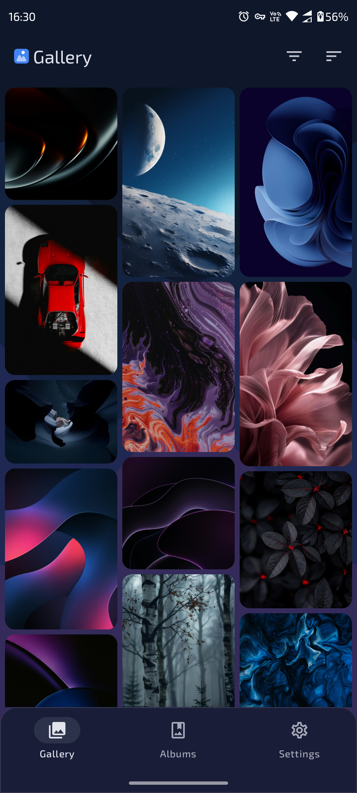
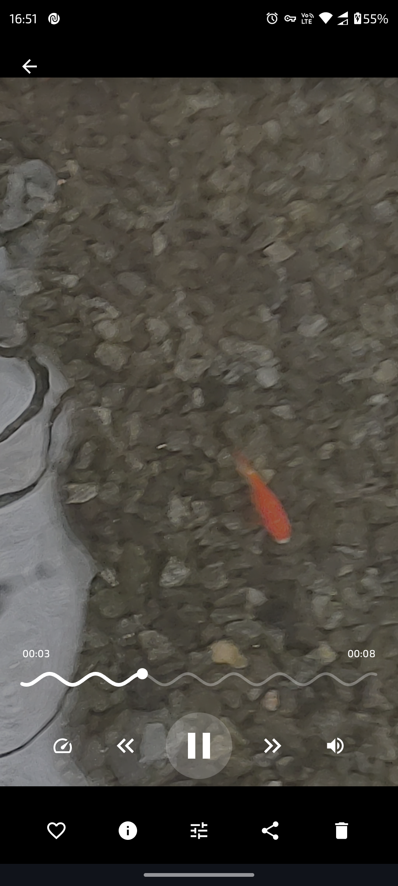
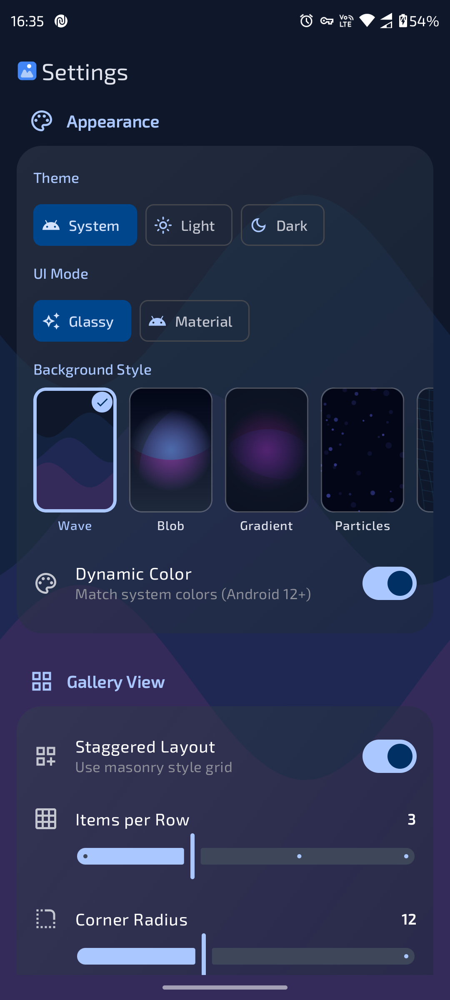
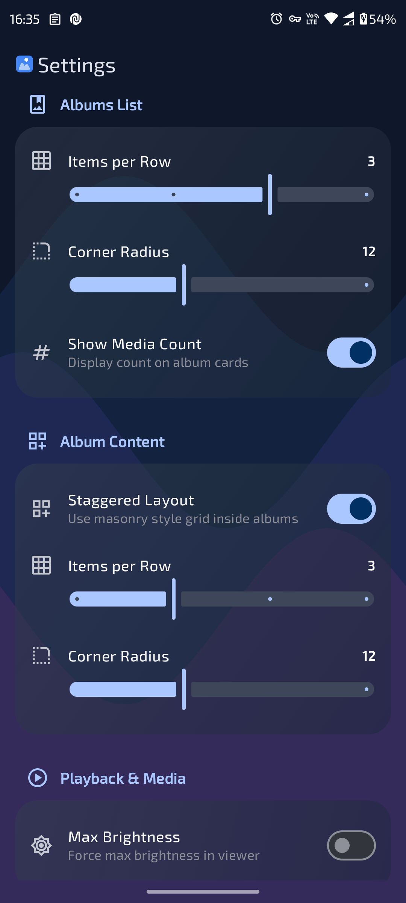
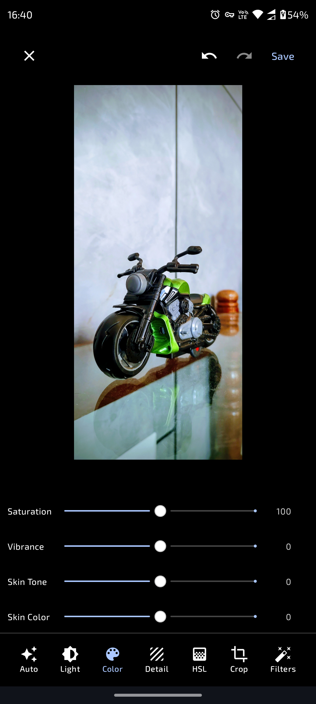
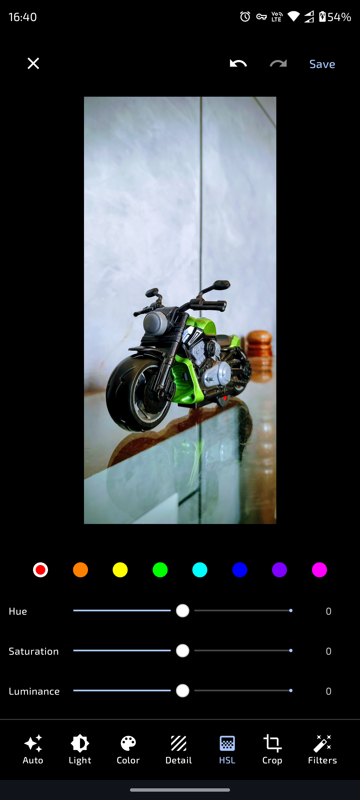
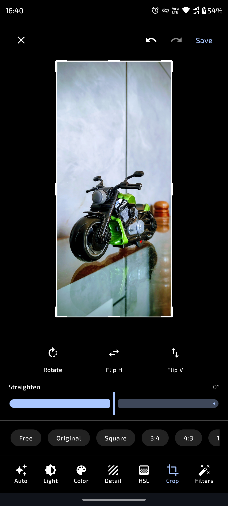
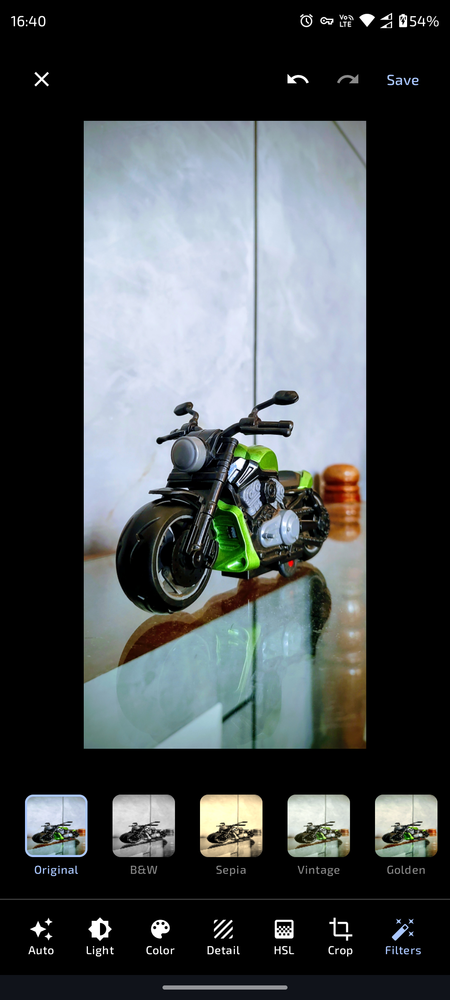

# Galleria - The AI Gallery App🖼

**Galleria** is a simple Android gallery application built entirely with **Jetpack Compose(Material3)**. It combines stunning aesthetics with powerful media management features, offering a fluid and highly customizable user experience.

---

## 📱 Screenshots

  
  
  
  

  
  
  
  

---

## ✨ Key Features

### 🎨 Visual Excellence
*   **Liquid Glass UI**: A stunning, modern interface featuring a frosted glass aesthetic with dynamic blurring and transparency.
*   **Immersive Viewer**: Edge-to-edge media viewing with gesture-based zoom, pan, and dismiss.
*   **Dynamic Theming**: Supports Material You (Dynamic Color) and custom accent palettes.
*   **Staggered Masonry Grid**: Beautifully displays images of varying aspect ratios.

### 🪄 Feature-Rich Image Editor
*   **Enhancement**: Auto enhancement option with highly customizable Exposure, Brightness, Contrast, Highlights, Shadows, Vibrance, and more.
*   **HSL Control**: Professional-grade manipulation of Hue, Saturation, and Luminance for individual color channels.
*   **Detail Enhancement**: Tools for Clarity, Sharpening, and Denoise to perfect your shots.
*   **Geometry Tools**: Crop, Rotate, Straighten, and Flip with an intuitive overlay.
*   **Filters**: Filters with multiple scene and mood.
*   **Blur**: Blur background of portraits.
*   **S-Curve**: Powerful S-Curve to edit more deeply.

### 🧠 On-Device AI Features
*   **Interactive Sticker Generation**: Cut out objects or subjects on-device using **MediaPipe DeepLab v3** segmentation, refined with a fast O(n) **Guided Filter (He et al. 2013)** to preserve delicate details like hair and fingers.
*   **Selection Refinement Suite**: Fine-tune generated stickers using a **Magic Wand** (color-connected flood fill with adjustable tolerance), manual **Add/Erase brushes**, and morphological operations (**Grow**, **Shrink**, **Smooth**). Includes a beautiful glowing "marching ants" border and sweep laser scan animations.
*   **Semantic Search**: Query your gallery using natural language (e.g., "sunset at the beach", "dog playing with ball") powered by an on-device TFLite **CLIP** text and image encoding model.
*   **Face Recognition & Clustering**: Detects faces with **Google ML Kit**, extracts 192-dimensional embeddings via **MobileFaceNet**, and clusters them using the **DBSCAN algorithm** with a strict constraint of one face per person per photo.
*   **Automatic Image Labeling**: Automatically categorizes and tags media on-device using **Google ML Kit Image Labeler** with a confidence threshold > 0.70.
*   **Background Analysis Pipeline**: Automatically schedules incremental media indexing via a WorkManager **CoroutineWorker** that analyzes untagged images in the background when the device is idle.

### ⚙️ Tools
*   **PDF Export**: Select multiple images and export them as a single PDF document.

### 🎬 Advanced Media Playback
*   **Custom Video Engine**: Built on **Media3 ExoPlayer** for seamless 4K playback.
*   **Gesture Controls**: Swipe to adjust brightness and volume; double-tap to seek.
*   **Smooth Transitions**: Shared element transitions and gesture-driven animations.

### 🗂️ Powerful Management
*   **Smart Albums**: Automatically organizes **Favorites**, **Screenshots**, and **Recycle Bin** for quick access.
*   **Enhanced Selection**: 
*   **Drag Select**: Intuitive multi-selection by dragging across the grid.
*   **Recycle Bin**: Safety net for deleted items with restore capability.

### ⚙️ Customization
*   **Grid Control**: Adjustable grid count to suit your viewing preference.
*   **Media Item Corner Radius Control**: Adjustable Media item corner radius control to suit your viewing preference.

---

## 🛠️ Tech Stack

*   **Language**: Kotlin 1.9+
*   **UI Toolkit**: Jetpack Compose (Material 3)
*   **Architecture**: MVVM with Clean Architecture principles
*   **Dependency Injection**: Hilt
*   **Async**: Coroutines & Flow
*   **Image Loading**: Coil (with VideoFrameDecoder)
*   **Video**: Media3 ExoPlayer
*   **Navigation**: Jetpack Navigation Compose
*   **On-Device Machine Learning**: Google ML Kit (Face Detection & Image Labeling), MediaPipe Tasks Vision (DeepLab v3 Image Segmentation), TensorFlow Lite (CLIP Semantic Search, MobileFaceNet)

---

## 🔧 Setup & Build

1.  Clone the repository.
2.  Open in Android Studio Ladybug or newer.
3.  Sync Gradle dependencies.
4.  Run on an emulator or device (Android 10+ recommended).

---

